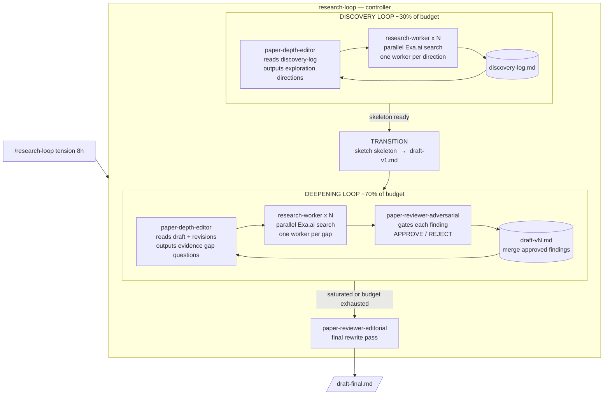

# deep-research

An autonomous research agent that runs 4–8 hours without human intervention. Give it a tension statement — a contradiction or unresolved question — and it produces a fully sourced thesis paper.

Built on Claude and [Exa.ai](https://exa.ai).

---

## Setup

```bash
export ANTHROPIC_API_KEY=your_key
export EXA_API_KEY=your_key
```

Open the project in Claude Code:

```bash
claude
```

---

## Usage

```
/research-loop "Every attempt to own the payment intent layer failed — and now 6 teams are trying again. What's actually different this time?" 8h
```

Optional scope flags:

```
/research-loop "your tension" 6h --domain "fintech, open banking" --exclude "crypto"
```

Start from an existing draft (skips discovery):

```
/research-loop research/my-paper/draft-v2.md 4h
```

---

## How it works



### State files

```
research/<paper-slug>/
  discovery-log.md   — findings accumulated during discovery
  draft-v0.md        — thesis skeleton
  draft-v1.md        — first full draft
  draft-vN.md        — one version per deepening cycle
  draft-final.md     — final output
  revisions.md       — full cycle log (directions, findings, approvals, rejections)
```

Drop a `human-feedback.md` in the paper directory at any time — the depth editor picks it up each cycle.
